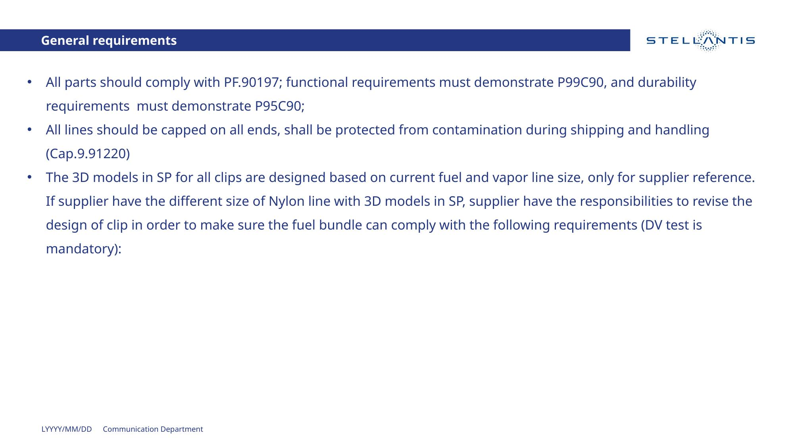
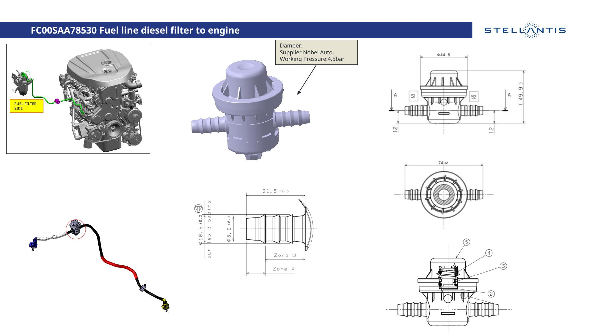
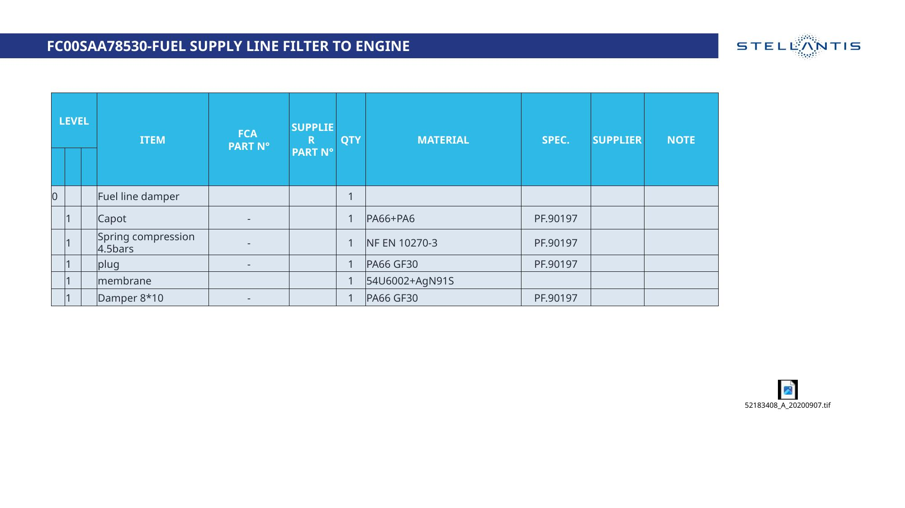

# KP1 Fuel Line Damper Description 解读

> 源文件: `KP1 Fuel line damper description.pptx`
>
> 项目: Stellantis（原FCA）柴油燃油管路脉动阻尼器

---

## 第1页 — 封面

- **项目阶段**: KP1 A&B（关键节点1，概念/初步设计阶段）
- **零件**: Fuel line diesel filter to engine（柴油滤清器到发动机的燃油管路）

---

## 第2页 — 通用要求（General Requirements）

列出了对供应商的三条核心要求：

1. **所有零件必须符合 PF.90197 规范**
   - 功能要求需达到 **P99C90**（99%可靠性 / 90%置信度）
   - 耐久要求需达到 **P95C90**（95%可靠性 / 90%置信度）

2. **管路末端必须加盖保护**，运输和搬运过程中防止污染（参照 Cap.9.91220）

3. **SP中的3D模型仅供参考**，如果供应商使用不同尺寸的尼龙管路，供应商有责任重新设计卡扣，确保燃油管束满足要求（DV测试为强制性）

---

## 第3页 — 零件详图（核心页面）

**零件号**: FC00SAA78530

| 信息 | 内容 |
|------|------|
| 供应商 | Nobel Auto |
| 工作压力 | 4.5 bar |

页面包含多张工程图：

- **左上**: 发动机总成图，标注了燃油管路走向和 "FUEL FILTER SIDE"（滤清器侧）位置
- **中间**: 阻尼器的 3D 渲染图，可见两端宝塔接头
- **右上**: 二维工程图（正视图），标注了外径 φ44.6、总高约 49.9mm 等关键尺寸
- **左下**: 燃油管路总成实物/渲染图（黑色 + 红色管段）
- **中下**: 接头部分的详细尺寸图（φ10.6、φ8.9、长度 21.5±0.5 等），标注了 Zone W 和 Zone X
- **右下**: 俯视图（外径 74±2）和剖视图（标注了 5 个零件编号位置）

---

## 第4页 — BOM 物料清单

**FC00SAA78530 - Fuel Supply Line Filter to Engine**

| 层级 | 零件名 | 数量 | 材料 | 规范 |
|------|--------|------|------|------|
| 0 | Fuel line damper（阻尼器总成） | 1 | — | — |
| 1 | Capot（盖帽） | 1 | PA66+PA6（尼龙混合） | PF.90197 |
| 1 | Spring compression 4.5bars（压缩弹簧） | 1 | NF EN 10270-3（不锈钢弹簧钢丝标准） | PF.90197 |
| 1 | Plug（塞子） | 1 | PA66 GF30（30%玻纤增强尼龙66） | PF.90197 |
| 1 | Membrane（膜片） | 1 | 54U6002+AgN91S（弹性体+银合金） | — |
| 1 | Damper 8×10（阻尼器壳体） | 1 | PA66 GF30 | PF.90197 |

图纸编号: 52183408_A_20200907.tif

---

## 第5页 — Backup

分隔页，后续可能有备用/补充资料（此文档中为空白）。

---

## 总结

这是一个 **柴油燃油管路脉动阻尼器** 的 KP1 阶段技术描述文件。

| 项目 | 内容 |
|------|------|
| 用途 | 安装在柴油滤清器到发动机之间的燃油供给管路上，抑制燃油压力脉动 |
| 工作压力 | 4.5 bar |
| 供应商 | Nobel Auto |
| 核心材料 | PA66 GF30（壳体/塞子）、弹簧钢丝（弹簧）、弹性体膜片 |
| 关键规范 | PF.90197（Stellantis 燃油管路通用规范） |
| 可靠性要求 | 功能 P99C90 / 耐久 P95C90 |

## 文件清单

| 文件 | 说明 |
|------|------|
| `KP1 Fuel line damper description.pptx` | 原始演示文稿 |
| `KP1 Fuel line damper description.pdf` | PDF 转换版本 |
| `slide-1.jpg` ~ `slide-5.jpg` | 各页幻灯片截图 |
